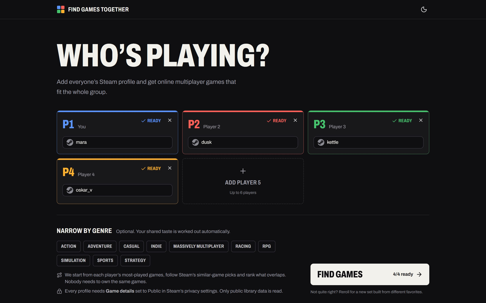
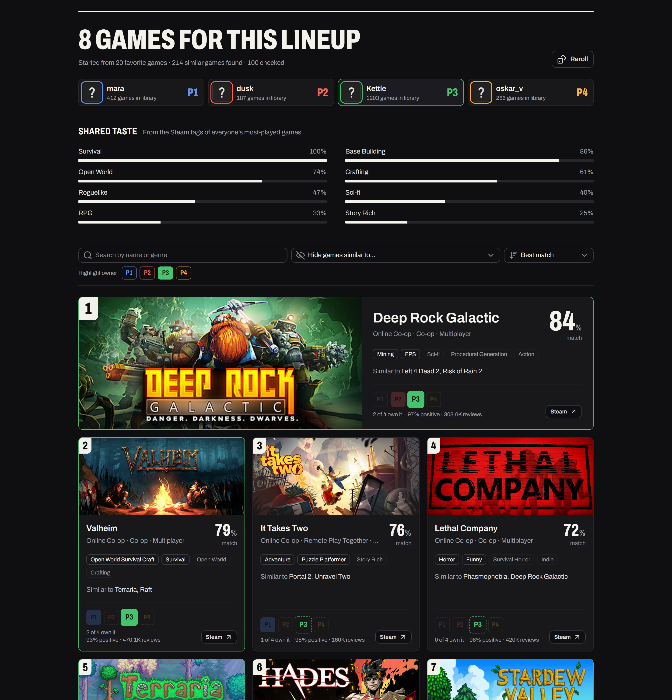

# Find Games Together

A platform for finding online multiplayer Steam games that you and your friends will all enjoy.

<p align="center">
  <a href="screenshots/screenshot-1.jpg"></a>
  <a href="screenshots/screenshot-2.jpg"></a>
</p>

Find Games Together takes the friction out of choosing what to play. Add two to six Steam profiles and get online multiplayer recommendations based on the games each person actually plays. The group does not need to own the same games.

## Features

- Read the public Steam libraries of 2-6 players.
- Accept profile URLs, SteamID64 values, and Steam vanity names.
- Infer a shared taste profile from the Steam tags of each person's most-played games.
- Discover new candidates through Steam's similar-game recommendations.
- Recommend online multiplayer games (online co-op, online PvP, MMO, Remote Play Together) that fit several players' histories.
- Exclude games the entire group already owns.
- Show existing ownership as context, not as the matching criteria.
- Optionally narrow recommendations to selected genres.
- Rank results by how strongly Steam's similar-game results overlap across players, adjusted for Steam review scores.
- Reroll from different favorite games each time, never repeating a game already shown.

## Tech stack

- [Nuxt](https://nuxt.com/)
- [Nuxt UI](https://ui.nuxt.com/)
- [Tailwind CSS](https://tailwindcss.com/)
- [Oxlint](https://oxc.rs/docs/guide/usage/linter.html)
- TypeScript

## Local development

Install the dependencies:

```bash
pnpm install
```

Create your local environment file:

```bash
cp .env.example .env
```

Fill in `NUXT_STEAM_API_KEY` in `.env`. You can create a Steam Web API key at [steamcommunity.com/dev/apikey](https://steamcommunity.com/dev/apikey).

Start the development server:

```bash
pnpm dev
```

The application will be available at [http://localhost:3000](http://localhost:3000).

## How recommendations work

1. **Favorites.** Each player's 15 most-played games (at least an hour, with a boost for games played recently) describe their taste. Software such as wallpaper or editing tools is skipped. Profiles that hide playtime fall back to a random sample.
2. **Seeds.** Every search picks 5 favorites per player, weighted toward the most played. Rerolls skip seeds already used in the session, so each round explores different parts of everyone's library.
3. **Candidates.** Steam's public **More Like This** pages give similar released games and similar top sellers for each seed. A game's affinity for a player grows with every seed of theirs that points to it.
4. **Filtering.** Only released games with online multiplayer (online co-op, online PvP, MMO, cross-platform or Remote Play Together) are kept. Games rated below 65% positive with 100+ reviews, games owned by everyone, and games already shown in the session are removed.
5. **Ranking.** Group fit rewards games several players point to, plus a small bonus for matching the group's shared Steam tags. It is weighted by a smoothed review score, and each further game led by the same seed is discounted so the list stays varied. That final value is the match percentage shown on every card, and results are ordered by it.

Store data comes from Steam's batched `IStoreBrowseService/GetItems` Web API and is cached per game, so one search makes only about ten requests to the Steam store website.

## Steam privacy requirements

Every player being compared must make both **Profile** and **Game details** public in Steam's privacy settings. Private libraries cannot be read by the Steam Web API. API credentials remain server-only, and the browser only receives the recommendation result.

## Quality checks

```bash
pnpm lint
pnpm typecheck
pnpm build
```

## Production

The `Deploy to Cloudflare Workers` GitHub workflow deploys pushes to `main` to
[findgamestogether.online](https://findgamestogether.online). Configure these
repository or `production` environment secrets before running it:

- `CLOUDFLARE_API_TOKEN`: a Cloudflare API token with Workers Scripts and zone
  DNS edit permissions for `findgamestogether.online`.
- `CLOUDFLARE_ACCOUNT_ID`: the Cloudflare account that owns the zone.
- `NUXT_STEAM_API_KEY`: the server-only Steam Web API key. The workflow uploads
  it as an encrypted Cloudflare Worker secret.

Build and preview the production application locally:

```bash
pnpm build
pnpm preview
```
